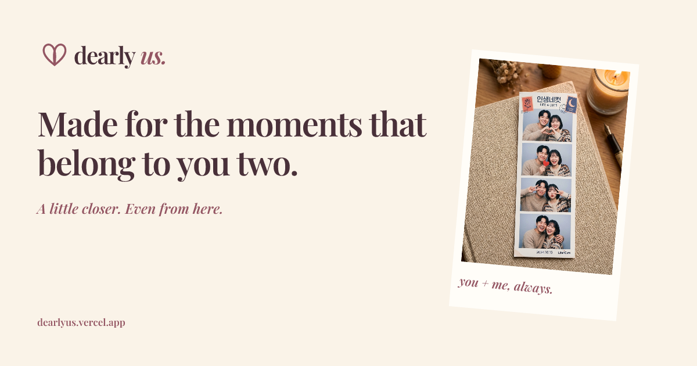
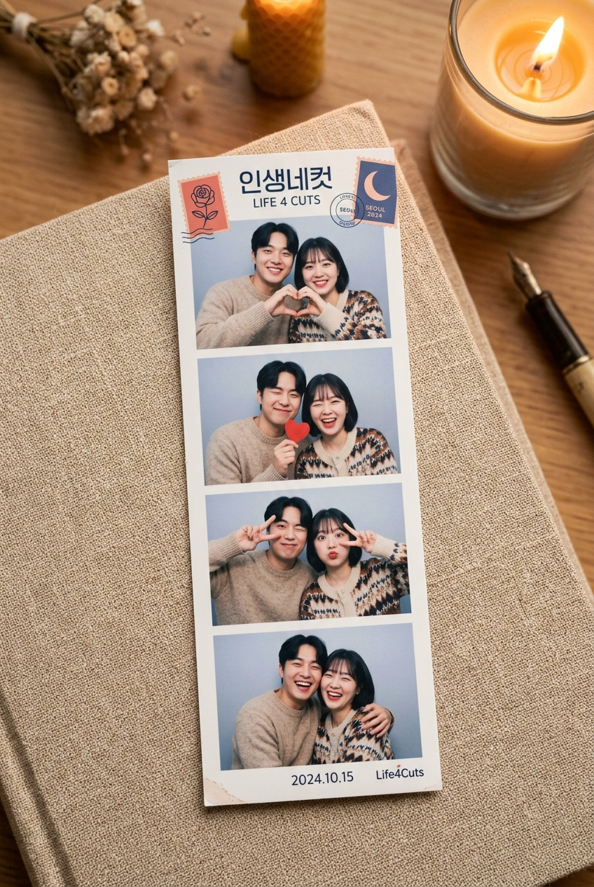
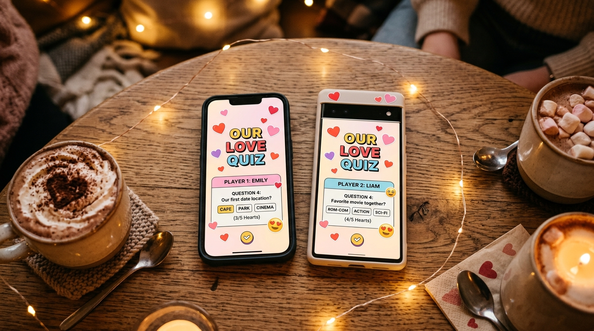
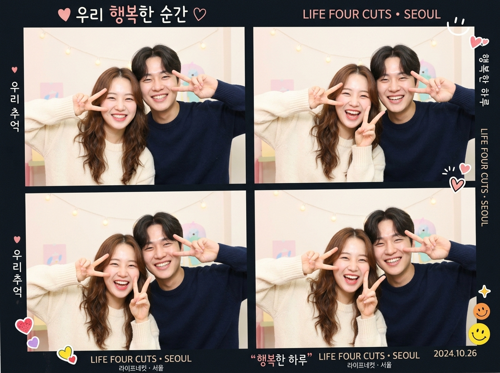

<div align="center">

  

  <h3><span style="color: #437EEB;">Made for the moments that belong to you two.</span></h3>

  <p>
    An intimate realtime date night sanctuary for couples separated by distance or sharing screens together.<br/>
    Synchronized Korean Life4Cuts photobooths, 3D interactive memory keepsakes, dual-blind quizzes, and live date games.
  </p>

  <p>
    <a href="https://nextjs.org/"></a>
    <a href="https://react.dev/"></a>
    <a href="https://www.typescriptlang.org/"></a>
    <a href="https://supabase.com/"></a>
    <a href="LICENSE"></a>
  </p>

  <br/>

  

</div>

---

## 🌸 About Dearly Us

Long distance dates often default to muted video calls or passive movie streaming. **Dearly Us** transforms screen-time into genuine connection:

- **Shared rooms with Google sign-in**: Create a profile, connect exactly one partner, and meet in a couple-authorized date-night lobby from any supported device.
- **Privacy by Design**: Camera feeds stay on the device. Shared activity events and deliberately saved keepsakes are protected by Supabase row-level security and private Storage policies.
- **Physical & Digital Keepsakes**: Export high-resolution 300 DPI *인생네컷* photostrips, printable thermal receipts of your quiz lore, phone wallpapers, and digital time capsule envelopes.

---

## 📸 Experience & Visual Gallery

<div align="center">
  <table>
    <tr>
      <td width="50%" align="center">
        
        <br/><b>Korean Life4Cuts Physical Keepsakes</b>
      </td>
      <td width="50%" align="center">
        
        <br/><b>Know Me Double-Blind Couple Quiz</b>
      </td>
    </tr>
    <tr>
      <td width="50%" align="center">
        
        <br/><b>Curated Couple Night Sanctuary Journey</b>
      </td>
      <td width="50%" align="center">
        
        <br/><b>DIY Fridge Magnet &amp; Printables Studio</b>
      </td>
    </tr>
  </table>
</div>

---

## 🌟 Key Architecture & Capabilities

### 📸 1. Synchronized Photobooth 3.0 (`/photobooth`)
- **Realtime Flash & Countdown**: Synchronized 3..2..1 photo countdown across both screens with camera flash simulation.
- **Bespoke Frames**: Choose from *Dearly Us Rose & Alabaster*, *Retro Vintage Vinyl*, *Tokyo Midnight Cafe*, *Pastel Sakura*, and *Korean Minimalist*.
- **Animated Video Strips**: Exports looping animated `.webm` live strips directly from the client canvas.

### 🧠 2. Adaptive Couple Quiz Engine (`/quiz`)
- **Double-Blind Lock-in**: Neither partner can peek at their partner's answer until both have clicked submit.
- **Adaptive AI with consent**: Contextual question generation is only enabled after an in-product consent choice.
- **Vintage Thermal Date Lore Receipts**: Renders dot-matrix style thermal receipts summarizing your answers, match %, and couple lore for 1-click download.

### 🌍 3. Interactive 3D Earth Globe & Clock Sync (`/timezone`)
- **Orthographic 3D Projection**: Great-circle geodesic flight arcs between partner cities with concentric heartbeat pulses.
- **Dual Local Time Calculator**: Synchronized timezone slider showing overlapping waking hours.

### 🎵 4. Multi-Track Ambient Soundscape Synthesizer (`/date`, Global Dock)
- **5 Procedural Audio Channels**: *Attic Rain*, *Cozy Fireplace*, *Tokyo Midnight Cafe*, *90s Vinyl Needle*, and *Lo-Fi Chords* with real-time Web Audio API synthesis.

---

## 🎮 Application Route Directory

| Route | Feature & Activity |
| :--- | :--- |
| **`/`** | Homepage with 3D flight globe, live partner cursors, instant room generator, and photostrip showcase. |
| **`/activity`** | Complete 17+ multiplayer date night activity catalog. |
| **`/photobooth`** | Korean Life4Cuts (*인생네컷*) 4-shot synchronized photobooth studio. |
| **`/timezone`** | Interactive 3D Earth Globe, geodesic flight arc, and couple clock sync. |
| **`/quiz`** | Know Me Quiz with secret lock-in, match scoring & Printable Thermal Receipt. |
| **`/host`** | "Third Wheel" Date Host game mode with playful observational commentary. |
| **`/cards`** | Honest Cards with kinetic swipe deck and 3 intimacy levels. |
| **`/dare`** | Truth or Dare with 20 mini-games and fast-tap duels. |
| **`/date`** | Date Night Planner & Multi-track Ambient Soundscape Mixer. |
| **`/bucket`** | 100 Dates Scratch-Off Checklist with progress bar and confetti. |
| **`/scrapbook`** | Digital Memory Corkboard with 3D polaroids, flight stubs & washi tape. |
| **`/letter`** | Time Capsule Letters with 3D wax seal cracking & unfolding envelope. |
| **`/birthday`** | Custom Birthday Gift Page generator with heart QR code. |
| **`/fashion`** | Couple PvP Fashion Runway with outfit voting. |
| **`/shirts`** | Digital matching outfit designer for date nights. |
| **`/shop`** | 100% Free DIY Printable Keepsakes (4×6 photo sheets, wallpapers, fridge magnets). |
| **`/august`** | Curated 7-step couple date night journey itinerary. |
| **`/match`** | 16-dimension romance personality compatibility test. |
| **`/arcade`** | Face-avatar retro mini-games (*Heart Jump*, *Asteroid Dodge*, *Berry Catch*). |
| **`/draw`** | Real-time dual shared canvas sketchpad. |
| **`/court`** | Playful couples dispute courtroom with AI Judge verdicts. |
| **`/debate`** | 60-second timed debate challenge with video on. |
| **`/lab`** | Co-op study date mode with Pomodoro timer & soundscapes. |
| **`/hunt`** | 60-second home scavenger hunt with camera proof. |
| **`/future`** | 3-year vision board planner with custom milestones. |
| **`/riddle`** | Co-op brain teasers and riddle night puzzles. |
| **`/iq`** | Head-to-head timed logic and spatial pattern duel. |
| **`/profile`** | Google-backed profile, names, cities, and private room code. |
| **`/login`** | Google-only sign-in with safe return-path handling. |
| **`/auth/callback`** | Supabase OAuth callback and automatic profile bootstrap. |
| **`/invite/:token`** | Minimal invite preview, confirmation, and protected couple connection. |
| **`/room/:code`** | Couple-authorized date-night lobby with Presence and readiness. |
| **`/creators`** | Creator community & date night video submission showcase. |
| **`/blog`** | Editorial blog with LDR date guides, ideas, and relationship advice. |
| **`/blog/:slug`** | Dynamic editorial article reader with scroll progress. |
| **`/privacy`** | Transparent privacy policy and shared-room data disclosure. |
| **`/terms`** | Terms of service and user conduct guidelines. |
| **`/api/config`** | Realtime room config & status API endpoint. |
| **`/api/stats`** | Live global stats endpoint. |

---

## 🗂️ Project Structure

| Directory | Purpose |
| :--- | :--- |
| **`app/`** | Routes, pages, and activity experiences. |
| **`components/`** | Shared interface components. |
| **`lib/`** | Authentication, couple, room, activity-session, and Supabase clients. |
| **`data/`** | Curated local prompts and content packs. |
| **`db/`** | Retained application schema definitions for reference. |
| **`supabase/`** | Live Supabase integration references and Edge Functions. |
| **`public/`** | Versioned static images, audio, fonts, and models used by the site. |
| **`docs/`** | Product and engineering roadmaps. |

Generated builds, local Supabase state, environment files, editor caches, and test reports are excluded through `.gitignore`.

---

## 🎨 Design System & Palette

Dearly Us utilizes a curated candlelight alabaster and plum-obsidian palette:

| Token | Hex Value | Role |
| :--- | :--- | :--- |
| `--paper` | `#FAF8F5` | Warm Candlelight Alabaster background |
| `--paper-subtle` | `#F3EFEA` | Soft linen contrast surface |
| `--ink` | `#1C1924` | Velvety Deep Plum-Obsidian typography |
| `--ink-soft` | `#6A6576` | Muted twilight body copy |
| `--line` | `#E8E2D9` | Delicate linen border hairline |
| `--pink` | `#FF4E78` | Rose Coral partner presence accent |
| `--blue` | `#437EEB` | Twilight Dusk Cerulean partner presence accent |

---

## 🚀 Getting Started Locally

### Prerequisites
- Node.js `>=20.0.0`
- npm, pnpm, or yarn

### Installation

```bash
# 1. Clone the repository
git clone https://github.com/yushy07/dearlyus.git
cd dearlyus

# 2. Install dependencies
npm install

# 3. Start development server
npm run dev
```

Open [http://localhost:3000](http://localhost:3000) in your browser.

### Verification & Production Build

```bash
# Type check the codebase
npx tsc --noEmit

# Build production bundle
npm run build
```

---

## 📄 License & Attribution

Licensed under the [Apache License, Version 2.0](LICENSE).  
Copyright © 2026 **Ayush Kant**. All rights reserved.

Designed & engineered with 💖 for couples making memories across any distance.
