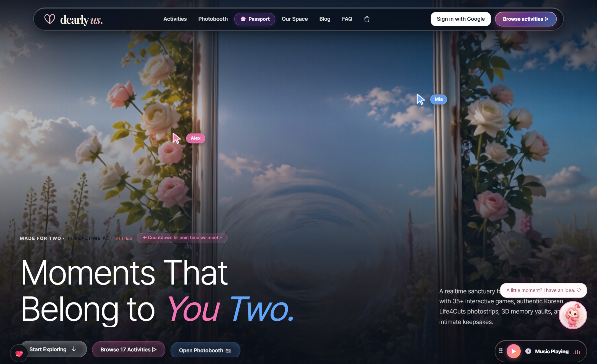
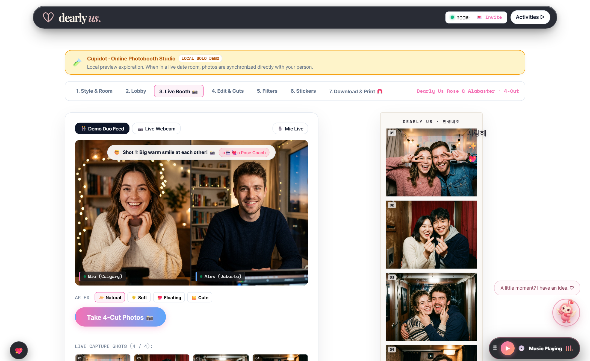
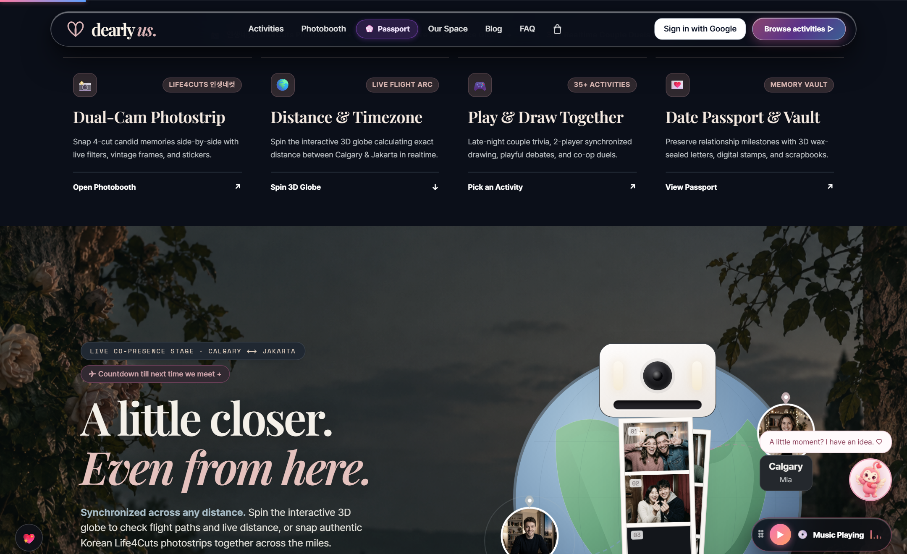
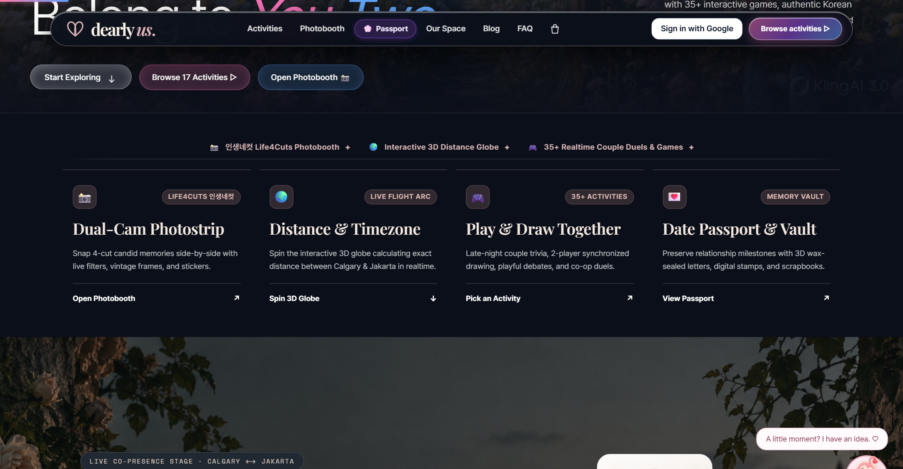
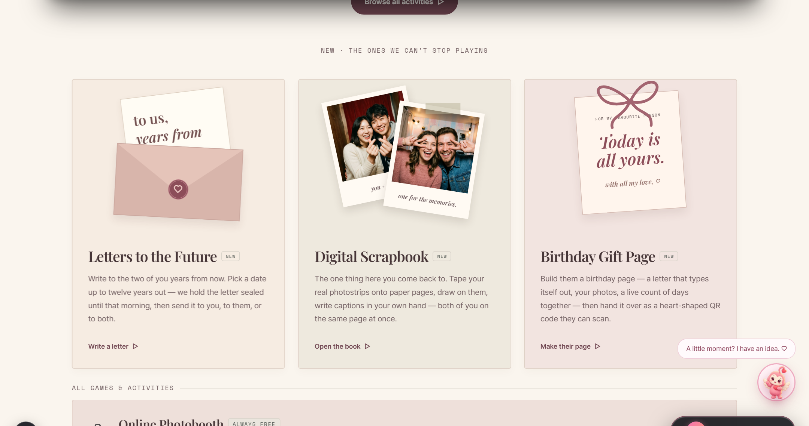
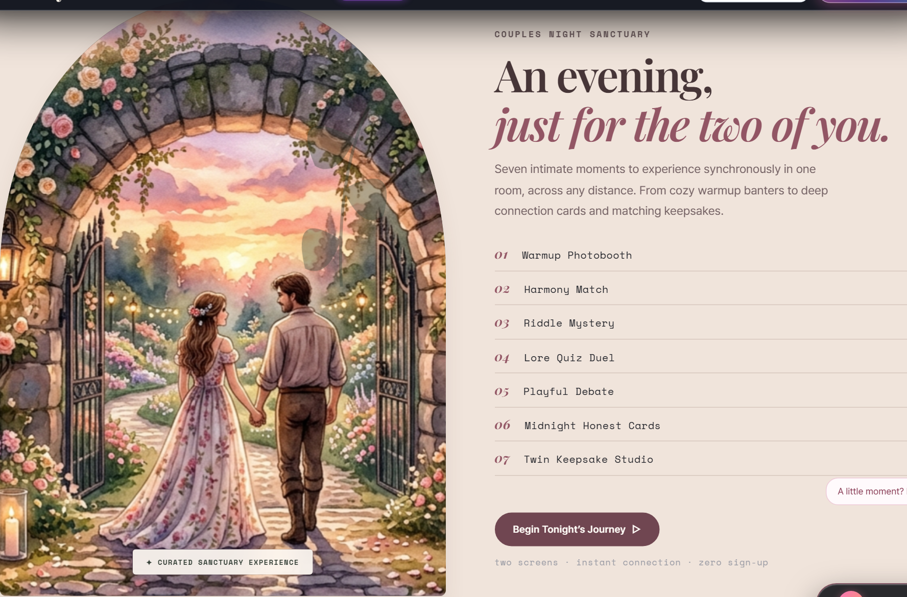
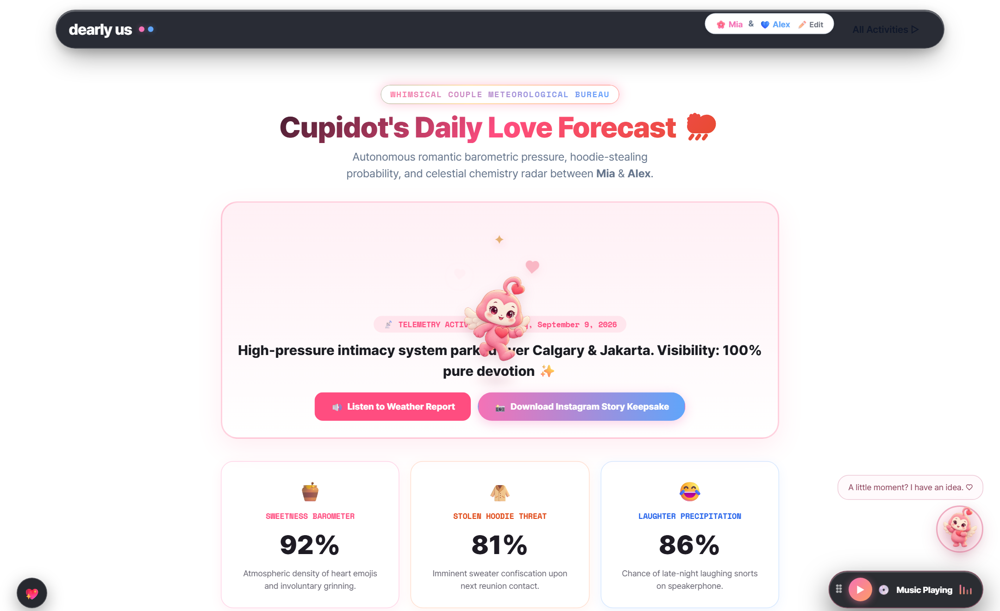
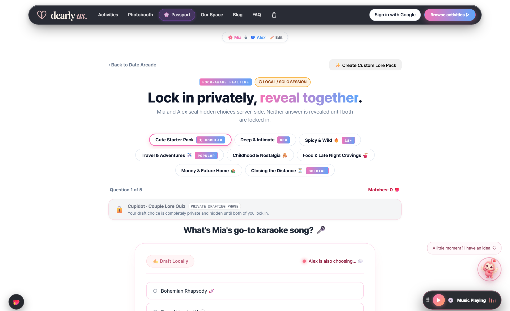
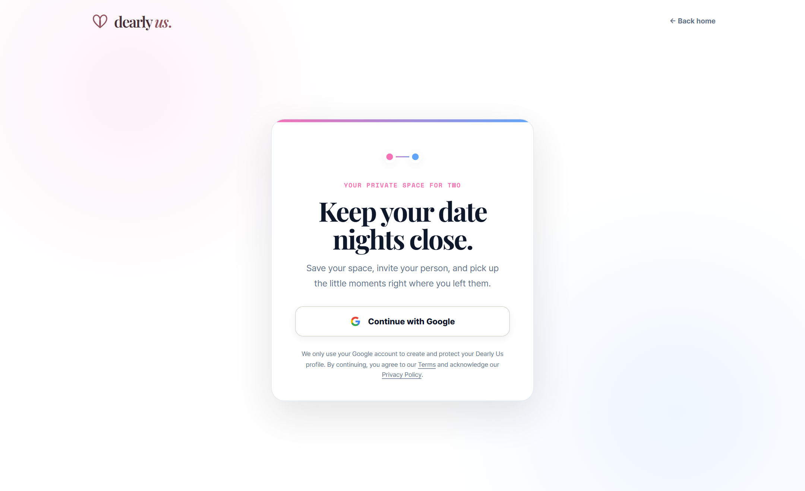
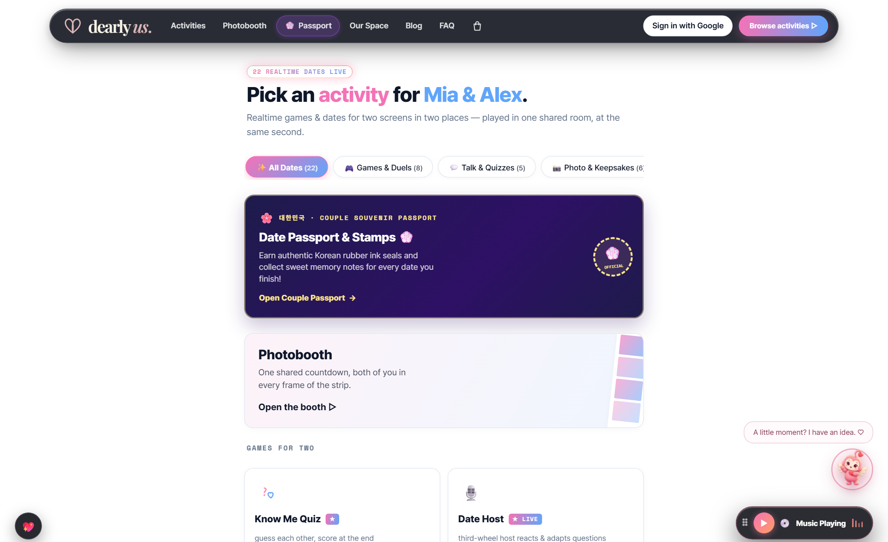

<div align="center">

  

  <h3><span style="color: #437EEB;">Made for the moments that belong to you two.</span></h3>

  <p>
    An intimate realtime date night sanctuary for couples separated by distance or sharing screens together.<br/>
    Synchronized Korean Life4Cuts photobooths, 3D interactive distance globe, physical paper keepsakes, dual-blind quizzes, daily love forecast, and live date games.
  </p>

  <p>
    <a href="https://nextjs.org/"></a>
    <a href="https://react.dev/"></a>
    <a href="https://www.typescriptlang.org/"></a>
    <a href="https://supabase.com/"></a>
    <a href="https://vitest.dev/"></a>
    <a href="https://playwright.dev/"></a>
    <a href="#-14-security-privacy--zero-taint-architecture"></a>
    <a href="LICENSE"></a>
  </p>

  <br/>

  <a href="https://github.com/yushy07/dearlyus">
    
  </a>

</div>

---

## 🌸 About Dearly Us

Long distance dates often default to muted video calls or passive movie streaming. **Dearly Us** transforms screen-time into genuine connection:

- **100% Free & Open Sanctuary**: No subscription fees, paywalls, or premium tiers. Every activity, photostrip, keepsake, and feature is completely free for all couples.
- **Bespoke Sanctuary Editorial Identity**: Elevated visual craftsmanship blending warm candlelight alabaster surfaces, tactile paper textures, and refined serif typography with the unified Dearly Us ribbon-heart brand mark.
- **Shared Rooms & Instant PINs**: Enter an instant 5-letter room code or connect via Google Sign-In to meet in an intimate, couple-authorized date-night sanctuary from any device.
- **Physical & Digital Keepsakes**: Export high-resolution 300 DPI _인생네컷_ photostrips, printable thermal receipts of your quiz lore, 9:16 vertical Instagram Story cards, wax-sealed time capsule letters, and digital memory corkboards.
- **Curated Date Night Journeys**: Move seamlessly through a thoughtful 7-step couple date night sequence—from sanctuary door to distance flight globe, photo booth, intimate quiz lock-in, and bedtime vows.
- **Privacy by Design**: Camera feeds stay on the device. Shared activity events and deliberately saved keepsakes are protected by Supabase row-level security and private Storage policies.
- **Zero-Guilt Architecture**: No punishment streaks, no decay counters, and decay-free relationship milestones designed to bring comfort, warmth, and joy.

---

## 📸 Real Experience Gallery (Captured Directly From Live App)

<div align="center">
  <table>
    <tr>
      <td width="50%" align="center">
        
        <br/><b>Cinematic Sanctuary Portal</b>
        <br/><sub>Unified BrandLogo lockup, floating Cupidot companion, ambient audio portal &amp; instant room entry</sub>
      </td>
      <td width="50%" align="center">
        
        <br/><b>Korean Life4Cuts (인생네컷) Studio</b>
        <br/><sub>Synchronized countdown, webcam feeds, AR FX, pose coach &amp; live printable strips</sub>
      </td>
    </tr>
    <tr>
      <td width="50%" align="center">
        
        <br/><b>Interactive 3D Distance Globe &amp; Flight Arcs</b>
        <br/><sub>Orthographic Three.js globe, geodesic flight path between cities, and photostrip printer</sub>
      </td>
      <td width="50%" align="center">
        
        <br/><b>Realtime Co-Presence Bridge</b>
        <br/><sub>Synchronized presence stage linking partner locations (Calgary ↔ Jakarta) in realtime</sub>
      </td>
    </tr>
    <tr>
      <td width="50%" align="center">
        
        <br/><b>Tangible Keepsake Artworks &amp; Activities</b>
        <br/><sub>Handcrafted paper renders: wax-sealed love letters, memory corkboards &amp; foil gift pages</sub>
      </td>
      <td width="50%" align="center">
        
        <br/><b>Curated 7-Step Date Night Journey</b>
        <br/><sub>Guided couple evening agenda from room lobby and photo booth to quiz lock-in and nightcaps</sub>
      </td>
    </tr>
    <tr>
      <td width="50%" align="center">
        
        <br/><b>Cupidot's Daily Love Forecast</b>
        <br/><sub>Cross-city romantic barometric pressure, sweetness radar &amp; Instagram Story export</sub>
      </td>
      <td width="50%" align="center">
        
        <br/><b>Double-Blind Couple Quiz</b>
        <br/><sub>Secret answer lock-in with match scoring &amp; downloadable vintage thermal receipts</sub>
      </td>
    </tr>
    <tr>
      <td width="50%" align="center">
        
        <br/><b>Our Space Relationship Sanctuary</b>
        <br/><sub>Shared relationship pet home, decor shelf, daily couple rituals &amp; anniversary constellation</sub>
      </td>
      <td width="50%" align="center">
        
        <br/><b>Multiplayer Date Night Catalog</b>
        <br/><sub>22+ interactive couple games, duels, quizzes, souvenir passports &amp; sketchpads</sub>
      </td>
    </tr>
  </table>
</div>

---

## 🌟 Key Architecture & Capabilities

### 🎀 1. Unified Brand Identity System (`lib/brand.ts`, `components/shared/BrandLogo.tsx`)

- **Bespoke Ribbon-Heart Lockup**: Entwined ribbon glyph symbolizing two lives woven together across distance, paired with editorial serif typography and the *"Sanctuary for Two"* badge.
- **Adaptive Component Variants**: Reusable `BrandLogo` component supporting `full`, `mark`, `compact`, and `wordmark` layouts with `sm`, `md`, and `lg` sizing scales.
- **Automated Brand Asset Pipeline (`scripts/generate-brand-assets.mjs`)**: Node.js script generating crisp SVGs, high-res PWA icons (`icon-192.png`, `icon-512.png`), `apple-touch-icon.png`, favicon suite, and social Open Graph preview banners (`og.png`, `og.svg`).

### 📸 2. Synchronized Korean Life4Cuts Photobooth (`/photobooth`)

- **Realtime Flash & Countdown**: Synchronized 3..2..1 photo countdown across both partner screens with camera flash simulation.
- **Bespoke Editorial Frames**: Choose from _Dearly Us Rose & Alabaster_, _Retro Vintage Vinyl_, _Tokyo Midnight Cafe_, _Pastel Sakura_, and _Korean Minimalist_.
- **Animated Video Strips**: Exports looping animated `.webm` live strips directly from client canvas capture.
- **Pose Coach & AR FX**: Integrated companion pose suggestions and real-time canvas filters (Soft, Natural, Floating Hearts, Retro Grain).

### 💌 3. Tangible Keepsake Artwork System (`components/home/KeepsakeArtwork.tsx`)

- **Physical Paper Craftsmanship**: Custom vector illustration engine rendering authentic physical keepsakes:
  - **Wax-Sealed Letters**: Deckle-edged parchment envelope sealed with warm vintage gold wax, stamped with vows for future dates.
  - **Memory Corkboard Scrapbooks**: Vintage polaroid snapshots with real tape textures, flight boarding stubs, and dried floral pins.
  - **Birthday Keepsake Parcels**: Wrapped gift parcel with satin ribbon bows and scannable couple QR code.
- **Interactive Micro-Interactions**: Hover tilts, soft elevation lifts, and direct routing into the active keepsake creators.

### 🗺️ 4. Curated 7-Step Date Night Sanctuary (`components/home/CuratedJourneyBand.tsx`)

- **Guided Evening Sequence**: Visual roadmap taking couples through an intimate date night progression:
  1. *Enter the Sanctuary* (`/room/new`) — Generate an intimate 5-letter private room.
  2. *Cross the Distance* (`/timezone`) — Sync clocks and trace geodesic flight arcs.
  3. *Check Today's Skies* (`/forecast`) — Read cross-city romantic weather and barometric sweetness.
  4. *Life4Cuts Studio* (`/photobooth`) — Take 4 synchronized photostrip memories.
  5. *Lock In Your Lore* (`/quiz`) — Secret answers and thermal receipt printing.
  6. *Tend Our Space* (`/our-space`) — Feed companion Cupidot and celebrate shared rituals.
  7. *Seal the Night* (`/letter`) — Write a time-capsule wax letter for future anniversaries.

### 🧠 5. Adaptive Couple Quiz Engine (`/quiz`)

- **Double-Blind Lock-in**: Neither partner can peek at their partner's answer until both have clicked submit.
- **Adaptive AI with Consent**: Contextual question generation is only enabled after explicit in-product consent.
- **Vintage Thermal Date Lore Receipts**: Renders dot-matrix style thermal receipts summarizing your answers, match %, and couple lore for 1-click download.

### 🌍 6. Interactive 3D Earth Globe & Clock Sync (`/timezone`)

- **Orthographic 3D Projection**: Great-circle geodesic flight arcs between partner cities with concentric heartbeat pulses.
- **Dual Local Time Calculator**: Synchronized timezone slider showing overlapping waking hours and golden date windows.

### 🌉 7. Realtime Co-Presence Bridge (`components/home/CoPresenceBridge.tsx`)

- **Dual-City Living Stage**: Displays partner avatars, exact local times, weather conditions, and physical separation distance in kilometers.
- **Interactive Soundboard**: Send instant atmospheric audio chimes and greetings across the screen with real-time feedback.

### 🎵 8. Multi-Track Ambient Soundscape Synthesizer (`/date`, Global Dock)

- **5 Procedural Audio Channels**: _Attic Rain_, _Cozy Fireplace_, _Tokyo Midnight Cafe_, _90s Vinyl Needle_, and _Lo-Fi Chords_ with real-time Web Audio API synthesis.

### 🕊️ 9. Cupidot: Shared Relationship Companion & Behavioral Brain (`/our-space`, `/profile`, Global Dock)

- **Draggable Floating Companion Dock**: Persists on-screen across routes with custom position storage (`useDraggableFixed`), voice mode toggle (_Chirp_, _TTS_, _Silent_), and keyboard-accessible modal dialogs.
- **Companion Moments System (`lib/cupidot-moments.ts`)**: 3 curated conversational moods (_Playful_, _Tender_, _Quiet_) with low-friction multiple-choice questions, witty bot reactions, and a no-repeat randomized draw pool.
- **Shared Pet Sanctuary in Our Space (`/our-space`)**: A decay-free relationship pet with 5 growth chapters, zero-punishment growth sparks, cozy decor items, custom rituals, relationship constellation, and memory weather.
- **Dual Presentation Engine**: 3D Three.js WebGL companion model with soft lighting alongside a lightweight, accessible 2D animated stage with walk cycles, reduced-motion support, and screen-reader announcements.
- **The Romance Spectrum & Safety Blueprint (`lib/cupidot-behavior.ts`)**: 6 intensity tiers (_Quiet_, _Warm_, _Romantic_, _Cheeky_, _Flirty_, _Spicy_) governed by a mutual consent ceiling (`min(levelA, levelB)`), session-scoped adult verification for sensitive tiers, and anonymous private intensity downgrades (_"Keeping things lighter."_).

### ⛅ 10. Daily Love Forecast & Story Keepsakes (`/forecast`)

- **Cross-City Synoptic Weather Report**: Live synthesized romantic weather forecast comparing partner cities, affection indices, severe romantic alerts, and daily relationship advice.
- **Web Speech Narration**: Built-in speech synthesis read-aloud featuring Cupidot's animated speaking states.
- **1-Click Story Card Exporter**: Generates high-resolution 1080×1920 (9:16) vertical story graphics with couple stamps and confetti animations for Instagram Stories or lock screens.

### 🏡 11. Our Space Sanctuary & Rituals Hub (`/our-space`, `/profile`)

- **Couple Rituals Engine**: Track daily morning & bedtime rituals, custom check-ins, and anniversary countdowns.
- **Relationship Constellation**: Visual map of milestones, keepsakes, and shared memories plotted across your journey.
- **Date Night Capsules**: Sealed time capsules and shared notes unlocked on custom anniversary dates.
- **Keepsake Approval Queue**: Mutual review workflow ensuring keepsakes are agreed upon before being saved to the permanent sanctuary album.

### ⚡ 12. Pluggable Activity Runtime & Multiplayer Adapters (`lib/activity-adapters/`, `lib/runtime/`)

- **Transport Abstraction**: Unified activity session runtime supporting real-time Supabase Broadcast/Presence channels with fallback to offline/mock adapters for rapid local development and automated testing.
- **Modular Game Adapters**: Standardized lifecycle interfaces (`onConnect`, `onEvent`, `onStateChange`) powering `/draw`, `/quiz`, `/dare`, and multiplayer minigames.

### 🌿 13. Atmospheric Backdrops & Viewport Optimization (`components/home/SceneBackdrop.tsx`, `styles/home-editorial.css`)

- **Editorial Atmosphere**: Cinematic garden evening background art and ambient luminous orbs enhancing homepage immersion without distracting from interaction.
- **Power & Frame-Rate Optimization**: Built-in `IntersectionObserver` that pauses background CSS animations and particle rendering when sections scroll out of the active viewport.

### 🔒 14. Security, Privacy & Zero-Taint Architecture (`lib/audio-security.ts`)

- **Client-Side Sink Sanitization**: Strict protocol verification (`blob:`, `data:audio/*`, verified `http:`/`https:`, safe relative paths) and `encodeURI()` normalization for voice notes, audio playback sinks, and media elements—neutralizing DOM-based XSS (CWE-79, CWE-116, CodeQL `js/xss-through-dom`) and unvalidated client-side redirects (CWE-601, CodeQL `js/client-side-unvalidated-url-redirection`).
- **Zero-Vulnerability Dependency Governance**: `npm audit` reports 0 vulnerabilities. Enforces dialect-level SQL identifier escaping (`drizzle-orm >=0.45.2`, GHSA-gpj5-g38j-94v9) and cross-dependency deduplication for dev-server CORS boundaries (`esbuild >=0.25.0`, GHSA-67mh-4wv8-2f99) via declarative npm overrides.
- **Client-First Media Protection**: Live camera streams stay strictly in-memory on the device; only explicitly sealed memories are written to couple-scoped, row-level-security protected Supabase buckets.

---

## 🎮 Application Route Directory

| Route                | Feature & Activity                                                                                                                         |
| :------------------- | :----------------------------------------------------------------------------------------------------------------------------------------- |
| **`/`**              | Editorial homepage with cinematic video reveal, interactive 3D flight globe, live partner presence, instant room PIN joiner, and photostrip showcase. |
| **`/activity`**      | Complete 22+ multiplayer date night activity catalog.                                                                                      |
| **`/arcade`**        | Face-avatar retro mini-games (_Heart Jump_, _Asteroid Dodge_, _Berry Catch_).                                                              |
| **`/birthday`**      | Custom Birthday Gift Page generator with heart QR code.                                                                                    |
| **`/blog`**          | Editorial blog with LDR date guides, ideas, and relationship advice.                                                                       |
| **`/blog/:slug`**    | Dynamic editorial article reader with scroll progress.                                                                                     |
| **`/bucket`**        | 100 Dates Scratch-Off Checklist with progress bar and confetti.                                                                            |
| **`/cards`**         | Honest Cards with kinetic swipe deck and 3 intimacy levels.                                                                                |
| **`/court`**         | Playful couples dispute courtroom with AI Judge verdicts.                                                                                  |
| **`/creators`**      | Creator community & date night video submission showcase.                                                                                  |
| **`/dare`**          | Truth or Dare with 20 mini-games and fast-tap duels.                                                                                       |
| **`/date`**          | Date Night Planner & Multi-track Ambient Soundscape Mixer.                                                                                 |
| **`/debate`**        | 60-second timed debate challenge with video on.                                                                                            |
| **`/draw`**          | Real-time dual shared canvas sketchpad.                                                                                                    |
| **`/fashion`**       | Couple PvP Fashion Runway with outfit voting.                                                                                              |
| **`/forecast`**      | Daily Love Forecast with cross-city weather sync, read-aloud & 9:16 Instagram Story card exporter.                                         |
| **`/future`**        | 3-year vision board planner with custom milestones.                                                                                        |
| **`/host`**          | "Third Wheel" Date Host game mode with playful observational commentary.                                                                   |
| **`/hunt`**          | 60-second home scavenger hunt with camera proof.                                                                                           |
| **`/invite/:token`** | Minimal invite preview, confirmation, and protected couple connection.                                                                     |
| **`/iq`**            | Head-to-head timed logic and spatial pattern duel.                                                                                         |
| **`/lab`**           | Co-op study date mode with Pomodoro timer & soundscapes.                                                                                   |
| **`/letter`**        | Time Capsule Letters with 3D wax seal cracking & unfolding envelope.                                                                       |
| **`/login`**         | Google-only sign-in with safe return-path handling.                                                                                        |
| **`/match`**         | 16-dimension romance personality compatibility test.                                                                                       |
| **`/our-space`**     | **Our Space Sanctuary**: Cupidot home area, decor shelf, shared rituals, relationship constellation, date night capsules & memory weather. |
| **`/passport`**      | Official Love Passport with souvenir stamps and dual-city boarding pass.                                                                   |
| **`/photobooth`**    | Korean Life4Cuts (_인생네컷_) 4-shot synchronized photobooth studio.                                                                       |
| **`/privacy`**       | Transparent privacy policy and shared-room data disclosure.                                                                                |
| **`/profile`**       | Partner settings, romance spectrum consent controls, voice preferences & private room code.                                                |
| **`/quiz`**          | Know Me Quiz with secret lock-in, match scoring & Printable Thermal Receipt.                                                               |
| **`/riddle`**        | Co-op brain teasers and riddle night puzzles.                                                                                              |
| **`/room/:code`**    | Couple-authorized date-night lobby with Presence and readiness.                                                                            |
| **`/scrapbook`**     | Digital Memory Corkboard with 3D polaroids, flight stubs & washi tape.                                                                     |
| **`/shirts`**        | Digital matching outfit designer for date nights.                                                                                          |
| **`/shop`**          | 100% Free DIY Printable Keepsakes (4×6 photo sheets, wallpapers, fridge magnets).                                                          |
| **`/terms`**         | Terms of service and user conduct guidelines.                                                                                              |
| **`/timezone`**      | Interactive 3D Earth Globe, geodesic flight arc, and couple clock sync.                                                                    |
| **`/auth/callback`** | Supabase OAuth callback and automatic profile bootstrap.                                                                                   |
| **`/api/config`**    | Realtime room config & status API endpoint.                                                                                                |
| **`/api/stats`**     | Live global stats endpoint.                                                                                                                |

---

## 🗂️ Project Structure

```
dearlyus/
├── app/                          # Next.js / Vinext application routes and pages
│   ├── (activities)/             # Interactive couple date games (photobooth, quiz, draw, court...)
│   ├── forecast/                 # Daily cross-city love weather forecast & story card export
│   ├── our-space/                # Canonical sanctuary hub & Cupidot home area
│   ├── profile/                  # Account settings, romance spectrum & room code
│   └── api/                      # Backend endpoints for stats, room configuration & callbacks
├── components/
│   ├── home/                     # Modular homepage components:
│   │   ├── DearlyCinematicHero   # Hero section with cinematic video reveal & floating widgets
│   │   ├── CoPresenceBridge      # Real-time partner presence & live distance cards
│   │   ├── InteractivePlayground # 3D Earth globe & photostrip machine simulator
│   │   ├── CuratedJourneyBand    # 7-step couple date night sanctuary journey
│   │   ├── KeepsakeArtwork       # Tangible paper keepsakes (wax letter, scrapbook, gift parcel)
│   │   ├── SceneBackdrop         # Viewport-optimized atmospheric backdrops & glows
│   │   ├── RoomCodeJoiner        # 5-letter PIN room inputs & live counter badges
│   │   ├── HomeActivitiesGrid    # Flagship date night activities gallery with keepsake art
│   │   ├── PhotoboothDemoStudio  # Real-time interactive photobooth demo with AR filters
│   │   └── HomeFaq               # Interactive accordion & couple support card
│   ├── bot/                      # Cupidot companion, 2D/3D stages & moments dialog
│   ├── our-space/                # Sanctuary widgets: rituals, constellation, capsules, weather
│   ├── shared/                   # BrandLogo, glassmorphic bars, ambient audio player, reaction bursts
│   │   ├── BrandLogo.tsx         # Unified brand logo component (full, mark, compact, wordmark)
│   │   └── Navbar.tsx            # Navigation bar with responsive BrandLogo and room PIN joiner
│   └── ui/                       # Accessible UI primitives (buttons, badges, dialogs, tabs)
├── lib/
│   ├── brand.ts                  # Canonical brand tokens, typography, and sanctuary badges
│   ├── activity-adapters/        # Standardized multiplayer activity adapters (quiz, draw, catalog)
│   ├── runtime/                  # Transport abstraction layer (Supabase vs Mock)
│   ├── audio-security.ts         # Audio URL sanitization, scheme whitelist & XSS/redirect sink protection
│   ├── cupidot-behavior.ts       # Romance spectrum rules, intent matching & consent bounds
│   ├── cupidot-moments.ts        # Conversational prompt deck across playful, tender & quiet moods
│   ├── voice.ts                  # Web Speech API engine & procedural chirp synthesizer
│   ├── use-draggable-fixed.ts    # Persistent viewport drag hook for the companion dock
│   ├── receipt-canvas.ts         # Thermal dot-matrix receipt canvas renderer
│   ├── couple.ts                 # Local & cloud couple state management
│   └── supabase.ts               # Supabase client & real-time connection helpers
├── styles/
│   ├── globals.css               # Base styles and theme configuration
│   └── home-editorial.css        # Comprehensive editorial styling system & atmospheric backdrops
├── data/                         # Curated local prompts, questions, and content packs
├── docs/                         # Architecture guides, roadmaps, and high-resolution screenshots
│   └── screenshots/              # Authentic live screenshots of website features (10 captures)
├── supabase/                     # Supabase migrations, storage policies & edge functions
├── tests/
│   ├── browser/                  # Playwright browser end-to-end specifications
│   ├── cupidot-moments.test.ts   # Companion moments deck & shuffle tests
│   ├── cupidot-behavior.test.ts  # Romance spectrum, intent dialogue & consent safety tests
│   ├── cupidot-pet.test.ts       # Growth chapter & spark progression tests
│   ├── letter-audio-sanitizer.test.ts # Audio URL sanitization & injection regression tests
│   └── activity-adapters.test.ts # Multiplayer activity adapter contract tests
├── public/                       # 3D models, SVG assets, audio files, photo samples & fonts
│   ├── logo.svg                  # Primary brand lockup
│   ├── brand-mark.svg            # Entwined ribbon-heart mark
│   └── scenes/                   # Atmospheric backdrop images (e.g. garden-evening.png)
└── scripts/                      # Utility scripts:
    ├── capture-all-screenshots.js # Automated Playwright capture suite for all 10 app views
    └── generate-brand-assets.mjs  # SVG and raster asset generator for icons & OG images
```

---

## 🎨 Design System & Palette

Dearly Us utilizes a curated candlelight alabaster and plum-obsidian editorial palette:

| Token                | Hex Value | Role                                           |
| :------------------- | :-------- | :--------------------------------------------- |
| `--paper`            | `#FAF8F5` | Warm Candlelight Alabaster background          |
| `--paper-subtle`     | `#F3EFEA` | Soft linen contrast surface                    |
| `--paper-elevated`   | `#FFFFFF` | Elevated pure card parchment                   |
| `--ink`              | `#1C1924` | Velvety Deep Plum-Obsidian typography          |
| `--ink-soft`         | `#6A6576` | Muted twilight body copy                       |
| `--line`             | `#E8E2D9` | Delicate linen border hairline                 |
| `--pink`             | `#FF4E78` | Rose Coral partner presence accent             |
| `--blue`             | `#437EEB` | Twilight Dusk Cerulean partner presence accent |
| `--gold`             | `#C49557` | Warm Vintage Gold wax seal & foil accent       |
| `--sage`             | `#6B8E7D` | Tranquil Sage evergreen accents                |

---

## 🚀 Getting Started Locally

### Prerequisites

- Node.js `>=22.13.0`
- npm, pnpm, or yarn

### Installation

```bash
# 1. Clone the repository
git clone https://github.com/yushy07/dearlyus.git
cd dearlyus

# 2. Install dependencies
npm install

# 3. Start development server
npm run dev
```

Open [http://localhost:3000](http://localhost:3000) in your browser.

### Capturing Fresh App Screenshots

```bash
# Automatically capture all 10 live app views with Playwright
node scripts/capture-all-screenshots.js
```

### Testing & Verification

```bash
# Run unit & behavior tests (Vitest)
npm test

# Run browser end-to-end tests (Playwright)
npm run test:browser

# Run fast static linter (Oxlint)
npm run lint

# Format code (Oxfmt)
npm run format

# Type check the codebase
npx tsc --noEmit

# Verify dependencies for zero known vulnerabilities
npm audit

# Build production bundle
npm run build
```

---

## 📄 License & Attribution

Licensed under the [Apache License, Version 2.0](LICENSE).  
Copyright © 2026 **Ayush Kant**. All rights reserved.

Designed & engineered with 💖 for couples making memories across any distance.
