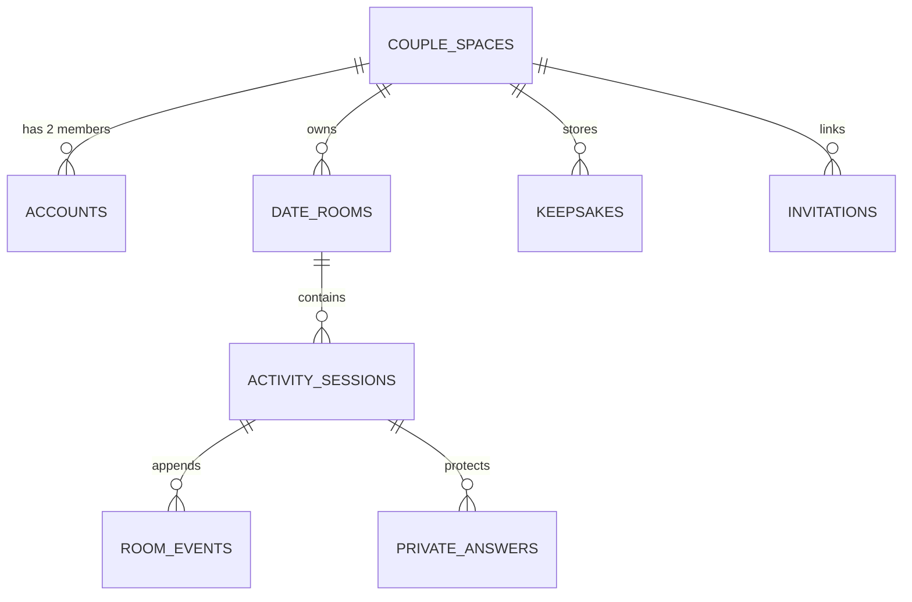

# Dearly Us — Live Supabase Handoff Specification & Security Contracts

This document contains the authoritative schema, RLS policies, RPC interfaces, and privacy contracts required for deploying the **Dearly Us** backend on Supabase.

> [!IMPORTANT]
> **Operating Rule Reminder:** These specifications are for the **Live Supabase Phase**. Existing Supabase files and SQL migrations in this repository are reference blueprints. Production deployment requires testing against this exact contract with two physical test accounts.

---

## 1. Schema Architecture & Tables



### 1.1 Table Definitions

1. **`couple_spaces`**
   - `id`: UUID PRIMARY KEY DEFAULT gen_random_uuid()
   - `partner_a_id`: UUID NOT NULL REFERENCES auth.users(id)
   - `partner_b_id`: UUID REFERENCES auth.users(id)
   - `status`: TEXT NOT NULL DEFAULT 'active' CHECK (status IN ('pending', 'active', 'paused', 'archived'))
   - `anniversary_date`: DATE
   - `created_at`: TIMESTAMPTZ NOT NULL DEFAULT now()

2. **`date_rooms`**
   - `id`: UUID PRIMARY KEY DEFAULT gen_random_uuid()
   - `couple_id`: UUID NOT NULL REFERENCES couple_spaces(id) ON DELETE CASCADE
   - `room_code`: TEXT NOT NULL UNIQUE
   - `status`: TEXT NOT NULL DEFAULT 'open' CHECK (status IN ('open', 'active', 'closed', 'expired'))
   - `active_activity`: TEXT
   - `created_at`: TIMESTAMPTZ NOT NULL DEFAULT now()
   - `expires_at`: TIMESTAMPTZ NOT NULL DEFAULT (now() + INTERVAL '24 hours')

3. **`activity_sessions`**
   - `id`: UUID PRIMARY KEY DEFAULT gen_random_uuid()
   - `room_id`: UUID NOT NULL REFERENCES date_rooms(id) ON DELETE CASCADE
   - `activity_type`: TEXT NOT NULL
   - `schema_version`: INT NOT NULL DEFAULT 1
   - `status`: TEXT NOT NULL DEFAULT 'drafting' CHECK (status IN ('drafting', 'active', 'locked', 'revealed', 'paused', 'completed', 'expired'))
   - `round_number`: INT NOT NULL DEFAULT 0
   - `revision`: INT NOT NULL DEFAULT 0
   - `last_sequence`: INT NOT NULL DEFAULT 0
   - `snapshot`: JSONB NOT NULL DEFAULT '{}'::jsonb
   - `result_summary`: JSONB NOT NULL DEFAULT '{}'::jsonb
   - `started_at`: TIMESTAMPTZ NOT NULL DEFAULT now()
   - `completed_at`: TIMESTAMPTZ

4. **`room_events`**
   - `id`: UUID PRIMARY KEY DEFAULT gen_random_uuid()
   - `session_id`: UUID NOT NULL REFERENCES activity_sessions(id) ON DELETE CASCADE
   - `sequence`: INT NOT NULL
   - `schema_version`: INT NOT NULL DEFAULT 1
   - `sender_id`: UUID NOT NULL REFERENCES auth.users(id)
   - `event_name`: TEXT NOT NULL
   - `event_payload`: JSONB NOT NULL DEFAULT '{}'::jsonb
   - `client_time`: TIMESTAMPTZ
   - `created_at`: TIMESTAMPTZ NOT NULL DEFAULT now()
   - CONSTRAINT uq_session_sequence UNIQUE (session_id, sequence)

5. **`private_answers` (Zero-Leak Answer Vault)**
   - `id`: UUID PRIMARY KEY DEFAULT gen_random_uuid()
   - `session_id`: UUID NOT NULL REFERENCES activity_sessions(id) ON DELETE CASCADE
   - `round_number`: INT NOT NULL
   - `user_id`: UUID NOT NULL REFERENCES auth.users(id)
   - `answer_payload`: JSONB NOT NULL
   - `locked_at`: TIMESTAMPTZ NOT NULL DEFAULT now()
   - `revealed_at`: TIMESTAMPTZ
   - CONSTRAINT uq_session_round_user UNIQUE (session_id, round_number, user_id)

6. **`keepsakes`**
   - `id`: UUID PRIMARY KEY DEFAULT gen_random_uuid()
   - `couple_id`: UUID NOT NULL REFERENCES couple_spaces(id) ON DELETE CASCADE
   - `created_by`: UUID NOT NULL REFERENCES auth.users(id)
   - `kind`: TEXT NOT NULL CHECK (kind IN ('activity', 'photo', 'note', 'milestone'))
   - `title`: TEXT NOT NULL
   - `caption`: TEXT
   - `media_url`: TEXT
   - `activity_path`: TEXT
   - `metadata`: JSONB NOT NULL DEFAULT '{}'::jsonb
   - `created_at`: TIMESTAMPTZ NOT NULL DEFAULT now()

---

## 2. Row Level Security (RLS) Policy Matrix

All tables enable RLS (`ALTER TABLE ... ENABLE ROW LEVEL SECURITY;`).

| Table | Policy Name | Command | Target Role | Permitted If |
| :--- | :--- | :--- | :--- | :--- |
| `couple_spaces` | `couple_members_read` | SELECT | authenticated | `auth.uid() = partner_a_id OR auth.uid() = partner_b_id` |
| `date_rooms` | `couple_rooms_all` | ALL | authenticated | Exists in `couple_spaces` where user is Partner A or B |
| `activity_sessions` | `session_access` | ALL | authenticated | Room belongs to user's active `couple_space` |
| `room_events` | `events_read` | SELECT | authenticated | Session belongs to user's active `couple_space` |
| `room_events` | `events_insert_denial` | INSERT | authenticated | **DENIED DIRECTLY** (Must be appended via `append_activity_event` RPC) |
| `private_answers` | `own_answer_read_only` | SELECT | authenticated | `user_id = auth.uid() OR (revealed_at IS NOT NULL AND session belongs to couple)` |
| `private_answers` | `vault_insert_denial` | INSERT | authenticated | **DENIED DIRECTLY** (Must be inserted via `lock_private_answer` RPC) |
| `keepsakes` | `couple_keepsakes` | ALL | authenticated | `couple_id` belongs to user |

> [!CAUTION]
> **Private Answer Security Rule:** `private_answers` SELECT policy strictly prohibits selecting a partner's answer row while `revealed_at IS NULL`. Even if a malicious client queries the table directly, PostgreSQL row-level security filters out the row entirely.

---

## 3. Authoritative RPC Specifications

### 3.1 `append_activity_event`
- **Purpose:** Atomically appends a sequenced event to `room_events`, checks optimistic concurrency (`expected_revision`), increments `last_sequence`, and advances `revision`.
- **Signature:**
  ```sql
  FUNCTION append_activity_event(
    target_session_id UUID,
    event_id UUID,
    event_name TEXT,
    event_payload JSONB,
    expected_revision INT DEFAULT NULL,
    client_time TIMESTAMPTZ DEFAULT NULL
  ) RETURNS JSONB;
  ```
- **Returns:**
  ```json
  {
    "accepted": true,
    "duplicate": false,
    "revision": 4,
    "sequence": 7
  }
  ```
- **Error Codes:**
  - `REVISION_CONFLICT`: If `expected_revision` does not match current session revision.
  - `FORBIDDEN`: If caller does not belong to the session's couple space.
  - `SESSION_CLOSED`: If session status is `completed` or `expired`.

### 3.2 `lock_private_answer`
- **Purpose:** Inserts or updates caller's sealed answer for the given round. Returns locked status without revealing the payload.
- **Signature:**
  ```sql
  FUNCTION lock_private_answer(
    target_session_id UUID,
    target_round INT,
    answer_payload JSONB
  ) RETURNS JSONB;
  ```
- **Returns:**
  ```json
  {
    "locked": true,
    "bothLocked": true,
    "lockedCount": 2
  }
  ```
- **Privacy Assurance:** `answer_payload` is stored in the vault and is NEVER included in the return value or emitted into `room_events`.

### 3.3 `reveal_private_answers`
- **Purpose:** Validates that both partners have locked answers for the round (or that the round was skipped), sets `revealed_at = now()`, and returns both sealed answers.
- **Signature:**
  ```sql
  FUNCTION reveal_private_answers(
    target_session_id UUID,
    target_round INT
  ) RETURNS JSONB;
  ```
- **Returns:**
  ```json
  {
    "roundNumber": 0,
    "answers": [
      { "userId": "uuid-a", "answer": 1, "lockedAt": "..." },
      { "userId": "uuid-b", "answer": 1, "lockedAt": "..." }
    ]
  }
  ```
- **Error Codes:**
  - `NOT_READY`: If caller attempts to reveal before both partners have locked.

### 3.4 `get_session_recovery`
- **Purpose:** Fetches current session metadata, authoritative snapshot, and all events with `sequence > after_sequence` for fast reconnect/refresh recovery.
- **Signature:**
  ```sql
  FUNCTION get_session_recovery(
    target_session_id UUID,
    after_sequence INT DEFAULT 0
  ) RETURNS JSONB;
  ```

---

## 4. Rollback & Disaster Recovery Procedures

1. **Schema Migration Rollback:** Every migration must be accompanied by an exact reverse `.down.sql` script.
2. **Accidental Disconnect:** Runtimes use `get_session_recovery` with `last_sequence` cursor to resume in under 200ms without state loss.
3. **Session Reset:** If an activity experiences unrecoverable state corruption, either partner can call `set_activity_paused` or restart the activity cleanly from drafting state.
